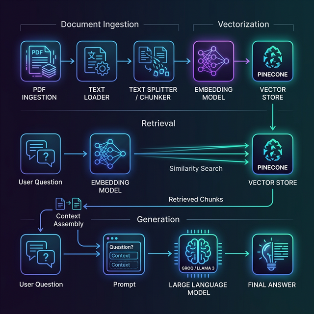

# 🤖 ChatBot Vector Engine

[](https://bun.sh)
[](https://js.langchain.com/)
[](https://opensource.org/licenses/MIT)

RAG (Retrieval-Augmented Generation) engine built with **Bun** and **LangChain**. This project focuses on efficient document processing, vector embeddings, and intelligent retrieval.

---

---

## 🧠 What is RAG? (The "Open Book" Analogy)

Imagine you're taking an exam:

- **Standard Chatbot**: Takes the exam from memory. If it hasn't seen the specific info before, it might guess or make things up (hallucination).
- **RAG (Our System)**: Is allowed to bring a **unique textbook** (your PDF) to the exam. It looks up the exact page before answering. This makes it 100% more accurate and grounded in YOUR data.

---

## 🏗️ How the System Works

The system is split into two main phases: **The Librarian** (storing info) and **The Researcher** (finding info).



### Phase 1: The Librarian (Knowledge Prep)

Before you can chat, we need to organize the data:

1.  **PDF Ingestion**: We read your PDF file like a scanner.
2.  **Chunking**: We cut the long text into small, bite-sized "snippets" (about 500 characters each).
3.  **Embedding**: We turn each snippet into a "Semantic Map Coordinate" (a list of numbers that represents its meaning).
4.  **Vector Store (Pinecone)**: We store these coordinates in a special filing cabinet that can find "similar meanings" instantly.

### Phase 2: The Researcher (Smart Chatting)

When you ask a question:

1.  **Search**: We turn your question into a map coordinate and ask Pinecone: _"Which snippets in the filing cabinet are closest to this question?"_
2.  **Retrieve**: We grab the top 3 most relevant snippets.
3.  **Generate**: We send your question + those 3 snippets to the AI (Groq/Llama 3) and say: _"Use only these snippets to answer the user."_

---

## 🚀 The Detailed Pipeline

### 1. Document Loading

We use `PDFLoader` from LangChain. It's designed to handle multi-page PDFs, extracting clean text while maintaining the original structure.

### 2. Document Chunking

We don't send the whole PDF to the AI at once—it's too much data! We use `RecursiveCharacterTextSplitter` to create overlapping snippets.

- **Chunk Size**: 500 tokens.
- **Overlap**: 100 tokens (this ensures no sentence is cut in half without context).

### 3. Semantic Embeddings

We use OpenAI's `text-embedding-3-small` model. It acts as a "DNA sequencer" for text, giving every sentence a unique numerical signature based on its meaning.

### 4. Vector Storage

**Pinecone** is our cloud-based database. Unlike a regular database, it doesn't search for keywords; it searches for **concepts**.

---

## 🏁 Getting Started

Follow these steps to get the ChatBot Vector Engine running on your local machine.

### 1. Clone the Repository

```bash
git clone https://github.com/nabinhamal/ChatBot_Vector.git
cd ChatBot_Vector
```

### 2. Install Dependencies

Ensure you have [Bun](https://bun.sh) installed, then run:

```bash
bun install
```

## 🛠️ Setup & Usage

### 1. Environment Configuration

Create a `.env` file based on `.env.example`:

```env
OPENAI_API_KEY=your_openai_key
PINECONE_API_KEY=your_pinecone_key
PINECONE_INDEX_NAME=your_index_name
GROQ_API_KEY=your_groq_key
```

### 2. Indexing Data (Training the Librarian)

Place your PDF in the root folder, then run:

```bash
bun run rag.js
```

This processes the PDF and saves the "knowledge" into Pinecone.

### 3. Start Chatting (Asking the Researcher)

Now you can talk to your data:

```bash
bun run chat.js
```

---

## 🛡️ AI Safety & Guardrails (Keeping it Secure)

To make an AI "Safe," we don't just let it talk; we give it a strict code of conduct:

### 1. Strict System Prompt

In `chat.js`, we tell the AI exactly how to behave. If it doesn't see the answer in your PDF, it **must** say _"I don't know"_ instead of guessing.

### 2. Input Sanitization

We process user questions to strip out potentially malicious formatting or "jailbreak" attempts that try to trick the AI into ignoring its rules.

### 3. Permission Control

We recommend using "Read-Only" API keys for the chat client. This ensures that even if the front-end is compromised, your database cannot be deleted or modified.

---

## 🎨 Frontend & UI

Looking for a beautiful interface to go with this engine? Check out our dedicated ChatBot UI repository:

👉 **[AI ChatBot UI](https://github.com/nabinhamal/AI)**

This repository contains the production-grade frontend and advanced chat logic to complement the Vector Engine.

---

## 📦 Tech Stack

- **Runtime**: [Bun](https://bun.sh) (Speed & Simplicity)
- **Framework**: [LangChain](https://js.langchain.com/) (The Orchestrator)
- **Embeddings**: OpenAI (The Semantic Engine)
- **Vector DB**: Pinecone (The Brain's Memory)
- **LLM Engine**: Groq (Llama 3.1 70B) (The Inference Engine)

---

<div align="center">
  <sub>Built with ❤️ by the Nabin Hamal</sub>
</div>
